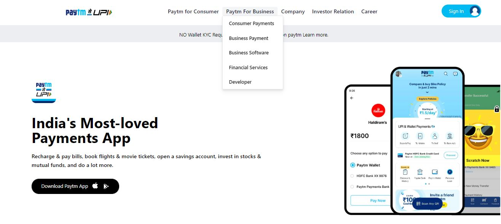
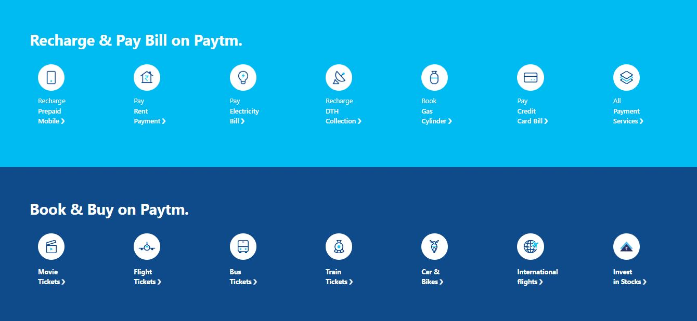
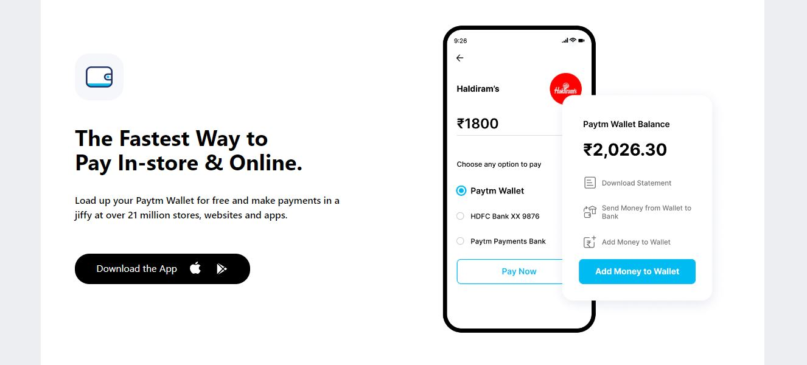
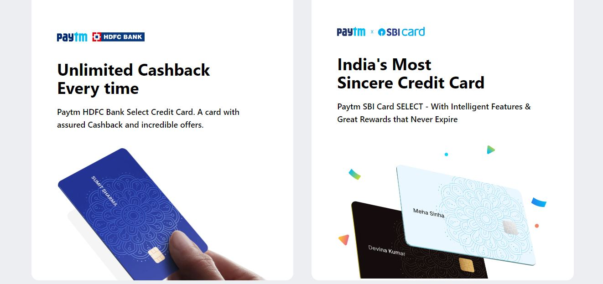

# Assignment 16

 

---

## Project 01  [Live link]()
- Skills Gained in this project
    - Learned about Tailwind css
    - Learned various properties of tailwind css.
    - Learned to make cards.
    - Learned about positioning and allignment.
    - Learned to write mediaquery for responviveness.
---

## Time taken to finish this project

- 36 hour taken to Finish this project.

Screenshots

- 1 

- 2 

- 3 

- 4 

- 5 

- 6 

